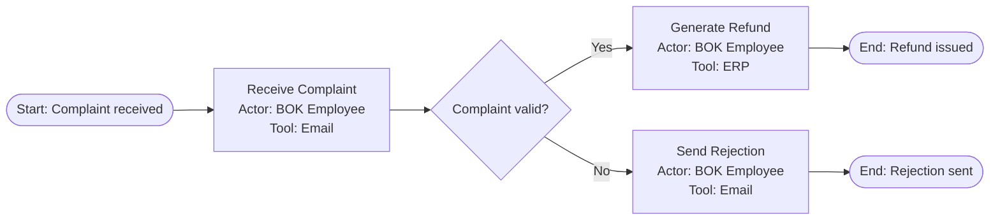

# Process Mapping

Generate structured process map diagrams from process descriptions. Each step is a block with **action**, **actor**, and **tool** — visually separated within the block.

**This skill draws diagrams.** It does NOT analyze processes, identify bottlenecks, recommend automation, or estimate ROI — that's the business-consultant's job. If the user asks for process analysis, direct them to the business-consultant skill and offer to generate diagrams from its output.

## Output Formats

1. **Excalidraw file** (default) — `.excalidraw` JSON file, opens in Obsidian (Excalidraw plugin), VS Code, excalidraw.com
2. **Mermaid** — when user explicitly requests it. Output inline in response (do NOT generate separate `.mmd` files — Mermaid renders directly in chat)

Default to Excalidraw unless the user says otherwise.

## Context Dependencies

| File | Purpose | Required? |
|------|---------|-----------|
| `context/process-mapping.md` | Output preferences, color overrides, API config | Recommended |
| Project `design-system.md` or `design-tokens.css` | Brand colors from vibe-coding | Optional |

If `context/process-mapping.md` is missing, use defaults and note: "Brakuje pliku `context/process-mapping.md` (preferencje kolorów, format output, ścieżki). Używam ustawień domyślnych. Uruchom /environment-setup aby skonfigurować."

## Workflow

### Step 1: Understand the Input

The user provides process steps — either:
- **Structured** — numbered list with actors and tools (ready to diagram)
- **Unstructured** — meeting notes, narrative, or transcript

For **unstructured input**, extract steps into a structured list and present for confirmation. Mark any information that is **inferred or assumed** (not explicitly stated) with `[assumed]` in the text response, and with ⚠️ on the diagram:

```
Extracted process (5 steps):
1. [Receive complaint] Actor: BOK Employee | Tool: Phone/Email
2. [Log ticket] Actor: BOK Employee | Tool: Ticketing System [assumed]
3. [Check order history] Actor: BOK Employee | Tool: CRM
4. [Approve?] Decision → Yes: step 5, No: step 6
5. [Generate refund] Actor: BOK Employee | Tool: ERP
6. [Send rejection] Actor: BOK Employee | Tool: Email [assumed]
```

**Important:** Do NOT add business analysis, bottleneck identification, or automation recommendations. If the user wants that, suggest using the business-consultant skill first, then come back here for diagrams.

### Step 2: Load Color Palette

Check for colors in this order (see `references/color-palette.md`):
1. Project design system (`design-system.md` or `design-tokens.css`)
2. Context overrides (`context/process-mapping.md`)
3. Default semantic palette

### Step 3: Generate Diagram

#### Excalidraw Output (Default)

Generate `.excalidraw` JSON file following:
- `references/json-schema.md` — file structure, element properties
- `references/element-templates.md` — block templates, decision diamonds
- `references/arrows-and-layout.md` — layout patterns, arrow routing
- `references/color-palette.md` — semantic colors

**Orientation: LEFT-TO-RIGHT** (horizontal flow). This is the default. Use vertical flow only if the user requests it or if the process is very short (≤4 steps).

**Block format** — every process step is a rectangle with three visually separated sections:
```
┌─────────────────────┐
│  Receive Complaint   │  ← action (bold, larger font)
├─────────────────────┤
│  Actor: BOK Employee │  ← actor (smaller, muted color)
│  Tool: Email         │  ← tool (smaller, muted color)
└─────────────────────┘
```
The action name is visually dominant. Actor and tool are secondary information below a divider line.

**Decision blocks** — use rotated squares (45° diamond shape). Since raw Excalidraw JSON breaks arrow bindings on diamonds, implement as a rectangle with `angle: 0.785` (π/4 radians) rotation. Keep text horizontal inside.

**Color coding for step types:**
- **Manual step** — blue palette (default)
- **Automated/system step** — purple palette
- **Problem/bottleneck step** — red palette (only if explicitly flagged by user or another skill)

**Single file policy:** When generating multiple related diagrams (AS-IS + TO-BE), put them ALL on one canvas in the same `.excalidraw` file. Position them side-by-side with clear section titles. Do not create separate files.

**Save** to project directory. Default: `docs/processes/[process-name].excalidraw`

**Build section by section** for large diagrams (>8 steps).

#### Mermaid Output

When explicitly requested, output Mermaid flowchart **inline in your response** (in a ```mermaid code block). Do NOT create separate `.mmd` files.



Note: use `flowchart LR` (left-to-right) as default direction.

### Step 4: Validate

Run through `references/validation.md` checklist. Report only if issues found — don't output validation details when everything passes.

### Step 5: AS-IS / TO-BE (if requested)

When the user provides both current and target process:

1. Draw both on **one canvas** — AS-IS on the left, TO-BE on the right
2. Use section titles: "AS-IS: [name]" and "TO-BE: [name]"
3. Visual differentiation:
   - Changed steps → purple (automated)
   - Removed steps → dashed red border
   - Unchanged steps → same as AS-IS
4. Do NOT add automation analysis — just visualize what the user described

## Response Format

Keep the response concise:
- Show extracted steps (if from unstructured input)
- State where the file was saved
- Note any assumptions marked with `[assumed]`

Do NOT include:
- Color legends or palette descriptions
- "Output files" sections listing what was generated
- Validation details (unless something failed)
- Business analysis, bottleneck analysis, or ROI estimates

## Boundaries

- This skill **draws process diagrams** — it does not analyze or optimize processes
- For process analysis → use business-consultant skill
- NOT for: architecture diagrams, ER diagrams, sequence diagrams, mind maps, org charts
- Process complexity: optimized for 3-20 steps. For 20+ steps, suggest sub-processes
- Language: supports Polish and English

## Commands

- `/process` or `/mapa` — invoke this skill
- `/mermaid` — force Mermaid output instead of Excalidraw
